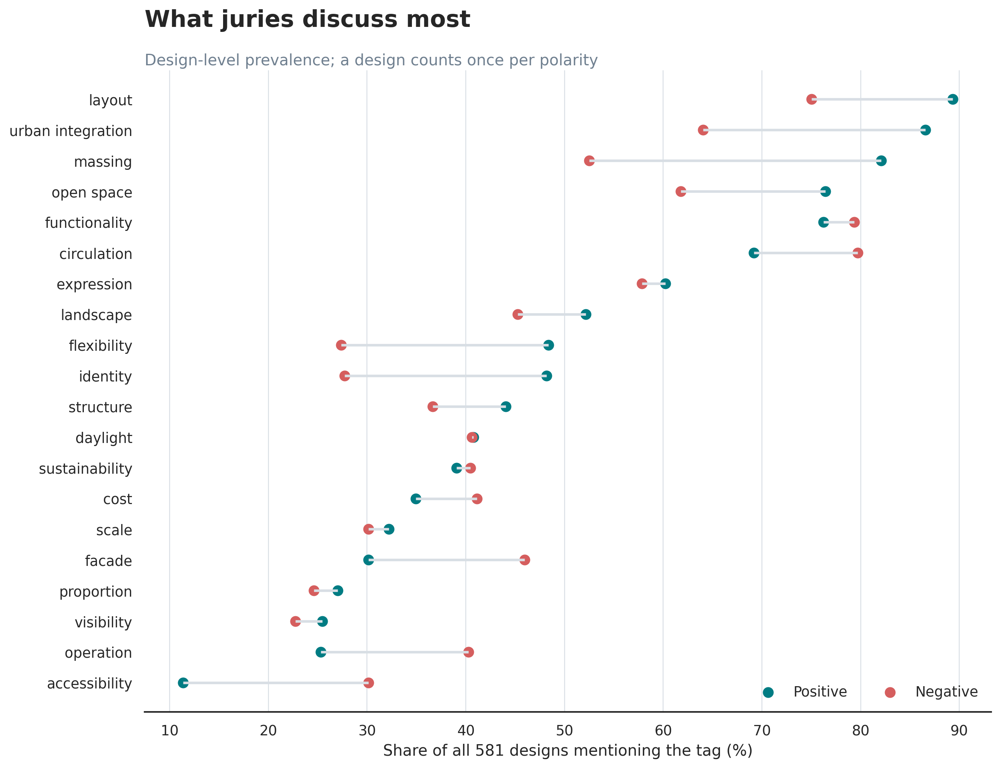
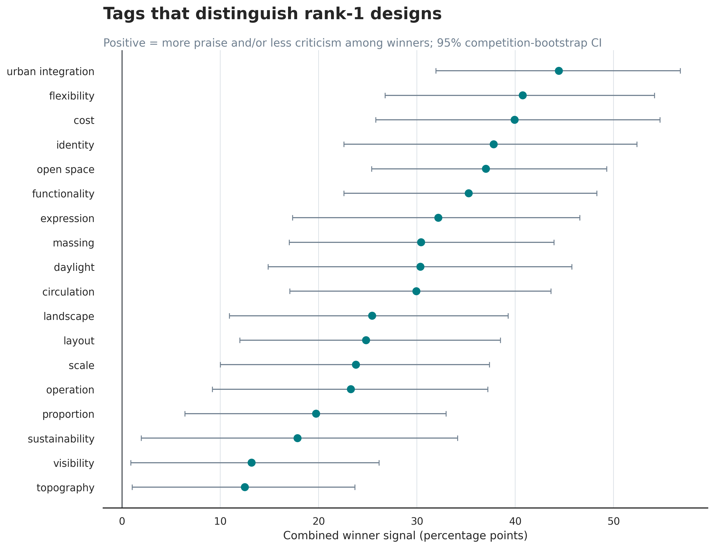
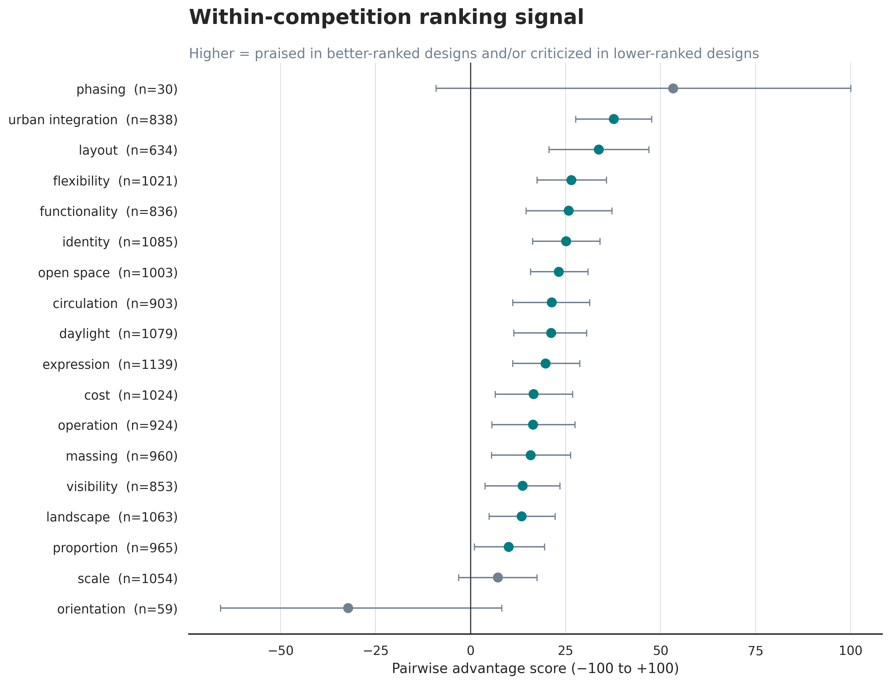
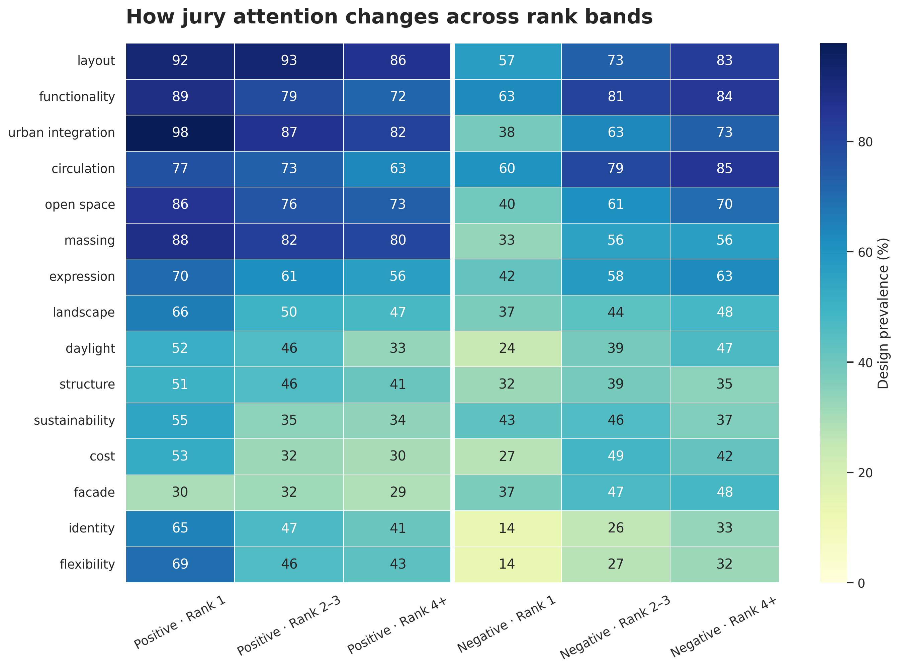
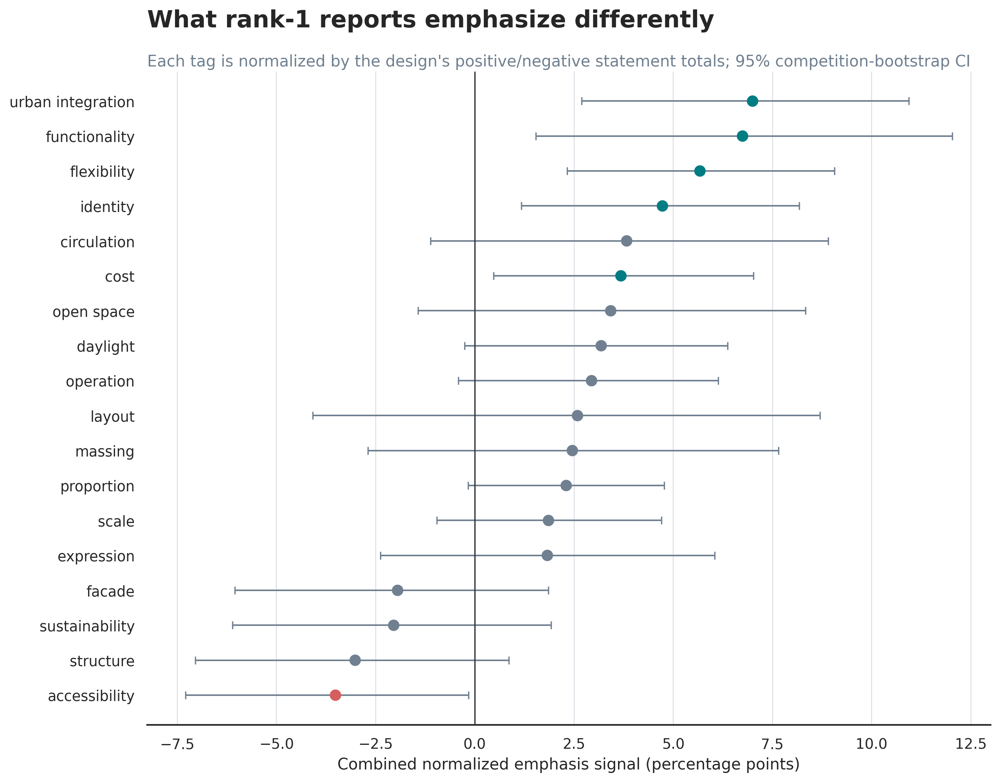

# Jury tags and competition ranking

## Dataset

- Extracted designs: 581
- Designs with rank metadata: 529
- Competition groups: 97
- Competitions eligible for winner analysis: 91
- Competitions eligible for unequal-rank pairwise analysis: 96
- Designs without rank metadata: 52
- Competition ID is the alphabetic prefix of `design_id`.

## Recommended interpretation

The primary unit is the design, not the individual sentence. Presence-based metrics prevent longer jury reports from receiving disproportionate weight. Winner results compare rank 1 with other ranked designs. Pairwise results compare every unequal-rank pair only within the same competition; ties are skipped.

The combined winner signal equals the winner/non-winner difference in positive-tag prevalence minus the corresponding difference in negative-tag prevalence. The pairwise score is positive when a tag is praised more often in the better-ranked design and/or criticized more often in the lower-ranked design.

These are associations, not causal effects. Confidence intervals use competition-level bootstrap resampling. Rare tags remain in the frequency tables but are excluded from headline ranking charts.

## Most discussed tags

layout, functionality, urban integration, circulation, open space, massing, expression, landscape

## Strongest rank-1 signals

| tag | combined_winner_signal_pp | ci_low | ci_high | ranked_design_support |
| --- | --- | --- | --- | --- |
| urban integration | 44.4 | 31.9 | 56.8 | 490.0 |
| flexibility | 40.8 | 26.7 | 54.2 | 322.0 |
| cost | 39.9 | 25.8 | 54.7 | 322.0 |
| identity | 37.8 | 22.6 | 52.4 | 308.0 |
| open space | 37.0 | 25.4 | 49.3 | 462.0 |
| functionality | 35.3 | 22.6 | 48.3 | 485.0 |

## Weakest or uncertain rank-1 signals

| tag | combined_winner_signal_pp | ci_low | ci_high | ranked_design_support |
| --- | --- | --- | --- | --- |
| orientation | -2.1 | -7.2 | 3.1 | 15.0 |
| accessibility | -0.2 | -14.0 | 13.1 | 188.0 |
| fire safety | 3.6 | -3.9 | 11.4 | 78.0 |
| ventilation | 3.7 | -5.2 | 12.6 | 55.0 |
| acoustics | 5.0 | -3.5 | 13.8 | 69.0 |
| structure | 10.5 | -3.7 | 25.3 | 319.0 |

## Strongest normalized emphasis signals

This metric controls for the number of positive and negative statements in each design's report.

| tag | combined_emphasis_signal_pp | ci_low | ci_high | ranked_design_support |
| --- | --- | --- | --- | --- |
| urban integration | 7.0 | 2.7 | 10.9 | 490.0 |
| functionality | 6.7 | 1.5 | 12.0 | 485.0 |
| flexibility | 5.7 | 2.3 | 9.1 | 322.0 |
| identity | 4.7 | 1.2 | 8.2 | 308.0 |
| cost | 3.7 | 0.5 | 7.0 | 322.0 |

## Strongest within-competition pairwise signals

| tag | pairwise_advantage_score | ci_low | ci_high | discordant_evidence |
| --- | --- | --- | --- | --- |
| urban integration | 0.38 | 0.28 | 0.48 | 838.00 |
| layout | 0.34 | 0.21 | 0.47 | 634.00 |
| flexibility | 0.27 | 0.17 | 0.36 | 1021.00 |
| functionality | 0.26 | 0.15 | 0.37 | 836.00 |
| identity | 0.25 | 0.16 | 0.34 | 1085.00 |
| open space | 0.23 | 0.16 | 0.31 | 1003.00 |

## Weakest or uncertain within-competition pairwise signals

| tag | pairwise_advantage_score | ci_low | ci_high | discordant_evidence |
| --- | --- | --- | --- | --- |
| orientation | -0.32 | -0.66 | 0.08 | 59.00 |
| acoustics | -0.03 | -0.23 | 0.17 | 276.00 |
| sustainability | -0.02 | -0.13 | 0.09 | 922.00 |
| structure | 0.00 | -0.11 | 0.11 | 1037.00 |
| safety | 0.01 | -0.13 | 0.16 | 534.00 |
| accessibility | 0.02 | -0.12 | 0.15 | 733.00 |

## Figures

